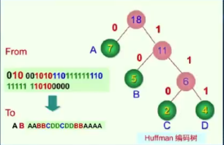

霍夫曼树
# 概念
1. 路径: 从1到其他的任意结点都有且仅有一条路径.
2. 路径长度: 路径上的边的个数. 例如: 从1到5的路径长度为2.
3. 树的路径长度: 树中所有结点的路径长度之和.例如: 有一棵树, 其中有5个结点, 路径长度分别为1, 2, 3, 4, 5, 则树的路径长度为1 + 2 + 3 + 4 + 5 = 15.
4. 带权路径长度: 树中所有叶子结点的带权路径长度之和.例如: 有一棵树, 其中有5个叶子结点, 权值分别为1, 2, 3, 4, 5, 则带权路径长度为1*1 + 2*2 + 3*3 + 4*4 + 5*5 = 55.

# 什么是霍夫曼树
带权路径长度最小的二叉树称为霍夫曼树, 也称为最优二叉树.

# 霍夫曼树的构造
将数字小的放在树的下边, 数字大的放在树的上边, 从而保证带权路径长度最小.例如: 有一组数字: 1, 4 , 8, 10, 13完整霍夫曼树如下:
```
       36
      / \
      13  23
        /  \
       10   13
            /  \
           8    5
               /  \
               1    4
```

# 霍夫曼编码
1. 定长编码: 例如: 有一组数字: 1, 4 , 8, 10, 13, 用3位二进制表示, 则1为001, 4为100, 8为010, 10为101, 13为110.
2. 变长编码: 例如: 有一组数字: 1, 4 , 8, 10, 13, 用二进制表示, 则1为1, 4为100, 8为1000, 10为1010, 13为1101. 可以看出, 变长编码比定长编码节省了空间，但是长度不固定，解码时需要知道每个数字的长度.

霍夫吗编码是定长编码:例如编码AB AABB CDD CDD BB AAAA,编码为:


# 霍夫曼译码
有一组数字: 1, 4 , 8, 10, 13, 用3位二进制表示, 则1为001, 4为100, 8为010, 10为101, 13为110. 
译码时, 从根结点开始, 从左到右依次读取二进制数, 读到0则向左, 读到1则向右, 读到叶子结点则输出该结点的值, 例如: 读到001, 则输出1, 读到100, 则输出4, 读到010, 则输出8, 读到101, 则输出10, 读到110, 则输出13.